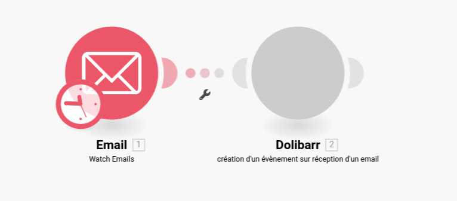

# Integration of Dolibarr to the Make automation platform
[![CC BY-SA 4.0][cc-by-sa-shield]][cc-by-sa]

This tutorial explains how to create a Make integration for Dolibarr using an integration that creates events in the agenda module as an example.

## Prerequisites

The following tutorial assumes that you have completed the following prerequisites:
* You have access to an instance of Dolibarr configured to use SSL encryption (with the HTTPS protocol)
* You have access to a user account with administrator rights
* You have activated the "Web Services API REST" module (if it is not already the case, follow the [official documentation](https://wiki.dolibarr.org/index.php/Module_Web_Services_API_REST_(developer)))
* You have obtained an API key for your user account that you will use to test your integration (generated by an administrator, or by the user himself if he has permission to modify his user account information)

When necessary, we will use the following URL to refer to your Dolibarr instance: `https://yourdolibarrurl`. You will have to replace it with the URL of your own Dolibarr instance, without trailing slash.

# Create the Make application

1. Go to <https://eu1.make.com> and log into your user account
2. Go to the `My Apps` tab
3. Click on `Create a new app`. You can call it `Dolibarr`. This instance will contain a connection and several modules that will implement specific features such as **creation of a task** or **creation of an event** for instance. 

In the `Base` tab, you just have to write 
```json
{}
```

# Configure authentication

It is essential to link the Make application (i.e Dolibarr) to the external application via a connection, which can be set in the `connection` tab of the Make application.

 This tab has two sub-tabs : `Parameters` tab and `Communication` tab.

*NB : The applications that a user can create on Make are written in `json`.*

## a) `Parameters` tab
There are three required parameters for the connection : the *Dolibarr API key*, the *URL of the Dolibarr instance* (`https://yourdolibarrurl` for instance) and your *user ID*. It means these parameters require some values in order to create a connection.  Thus, you can write the following code :

```json
[
    {
        "name": "apiKey",
        "type": "text",
        "label": "Dolibarr API key",
        "required": true
    },
    {
        "name": "hostname",
        "type": "text",
        "label": "Dolibarr instance URL",
        "required": true
    },
    {
        "name": "userownerid",
        "type": "number",
        "label": "User ID",
        "required": true
    }
]
```
NB : In each tab, save the written code with `Ctrl+S`

## b) `Communication` tab 
The following code specifies the account validation process. 
```json
{
	"url":"{{parameters.hostname}}/api/index.php/users/info",
	"headers": {
		"DOLAPIKEY": "{{parameters.apiKey}}"
	},
	"log": {
		"sanitize": ["request.headers.DOLAPIKEY"]
	}
}
```
NB : In each tab, save the written code with `Ctrl+S`

# Create an action module
## Example of module to create events in the Dolibarr calendar
As a reminder, the goal is to implement the following use case :
>"As soon as you receive a mail on an Email box, report it in Dolibarr events"

In this case, the Dolibarr instance receives information from the Email application. In this case, the Email application is a trigger generating an action in Dolibarr.

On the Dolibarr side, the module to implement is an action module, that we can call `Creation of an event`. This module can be configured in different tabs which are detailed below. The different tabs are connected so that some parameters can be used in a tab that is different from itself.

### a) `Communication` tab
This tab contains the different required parameters that will be transmitted from the Email application to Dolibarr. The required parameters are the one required by the API.

You have to fill the code block of this tab as follows :
```json
{
    "url": "{{connection.hostname}}/api/index.php/agendaevents",
    "method": "POST",
    "qs": {},
    "body": {
        "type": "Email reception",
        "label": "{{parameters.label}}",
        "type_code": 6,
        "userownerid": "{{connection.userownerid}}",
        "email_sender": "{{parameters.name}}",
        "email_from": "{{lower(parameters.email)}}",
        "percentage": "-1",
        "status": "0",
        "date_creation": "{{parameters.date}}",
        "datep": "{{parameters.date}}",
        "datef": "{{parameters.date}}"
    },
    "headers": {
        "DOLAPIKEY": "{{connection.apiKey}}"
    },
    "response": {
        "output": "{{body}}"
    }
}
```
NB : In each tab, save your code with `Ctrl+S`

**Explanation of the different required fields :**

| API field     | Description                         | Type                            | Possible value            |
|---------------|-------------------------------------|---------------------------------|---------------------------|
| type          | Event type                          | text                            | Email reception           |
| label         | Event label                         | text                            | New emails received       |
| type_code     | Dolibarr event type code            | number                          | **6**                     |
| userownerid   | Dolibarr user that create the event | number                          | 7                         |
| email_sender  | Login of the sender                 | text                            | jdoe                      |
| email_from    | Email address of the sender         | text                            | john@doe.org              |
| status        |                                     | number                          | 0                         |
| percentage    | Event progress                      | number between -1 (N/A) and 100 | -1                        |
| date_creation | Date of creation of the event       | date                            | 2023-03-12T18:25:43-05:00 |
| datep         | Start date of the event             | date                            | 2023-03-12T18:25:43-05:00 |
| datef         | End date of the event               | date                            | 2023-03-12T18:25:43-05:00 |

The type_code "6" corresponds to the event type "Email reception".

NB : Bold parameters are compulsory for this scenario

**Select a connection :**
Under the previous code block, you have to select a connection. Select the `Dolibarr connection` that you created previously.

### b) `Static parameters` tab
```json
[
    {
        "name": "type",
        "type": "text",
        "label": "Type",
        "value": "Email reception"
    }
]
```
NB : In each tab, save the written code with `Ctrl+S`

### c) `Mappable parameters` tab
The following parameters are mappable, that means it must be completed by the user.
```json
[
    {
        "name": "email",
        "type": "email",
        "label": "Email address",
        "required": true
    },
    {
        "name": "name",
        "type": "text",
        "label": "Name",
        "required": true
    },
    {
        "name":"label",
        "type":"text",
        "label":"Mail label",
        "required": true
    },
    {
        "name":"date",
        "type":"date",
        "label":"Received on",
        "required": true
    }
]
```
NB : In each tab, save the written code with `Ctrl+S`

### d) `Interface` tab
```json
[
    {
        "name": "id",
        "type": "uinteger",
        "label": "User ID"
    }
]
```
NB : In each tab, save the written code with `Ctrl+S`

Your integration is now ready to be used.

## 1st scenario : Report an email in Dolibarr events

### 1) Create a new scenario

1) Click on the `Scenarios` tab of the left-hand menu
2) Click on the `Create a new scenario` button at the top right

### 2) Email scenario configuration 
#### 2.a) Email scenario initialization
1) Click on the `+` symbol to add a module
2) Select the `Email` module, that you can search it at the bottom of the drop-down list.
3) Select the `Watch Emails` trigger of this module.
To set up the Email module, you should click on it. A configuration window will appear.

#### 2.b) Email module configuration

1. First, choose the **connection** : select the IMAP connection that you configured (named *My others IMAP connection*)
2. Select the `/INBOX` **folder**
3. Select the `Only unread mails` **criteria**
4. Click on `No`  for `Mark message(s) as read when fetched` unless you want to mark messages as read.
5. Don't forget to click on `OK` at the bottom right of the window.

#### 2.c) Dolibarr module configuration

Add the Dolibarr application by selecting the `Create an event` action that you created previously.

In the end, your screen should look like this :



Once you have your scenario is set up, you should fill the Dolibarr module fields with some Email fields, by following the steps below  :

1. Select the right **connection**
2. Select the **Email address** with `1. Sender Email Address`
3. Select the **Name** with `1. Sender Email Name`
4. Select the **Mail label** with `"1. Sender Email Name" : "1. Subject"`
5. Select the **Received on** field : `1.Date`
6. Choose the **Type** : 1


7. Click on `OK`

The scenario can now be executed. For this, click on the `Run` button at the bottom left of the screen.


## Example of a module implementation to create a project task on Dolibarr

As a reminder, the goal is to implement the following use case :

>"Creation of a project task in Dolibarr once an issue is created on Github"

In this case, the Dolibarr instance receives information from Github. Github is a trigger that generates an action in Dolibarr, of creating a project task (`Projects` tab, `Tasks/Activities` section).

Here is the code that must be implemented on Make, to realize the scenario of creation of a project task in the module `Projects` of Dolibarr.

**Required fields :**
There are two types of required fields, the ones which are required to create a valid task that can be accepted by Dolibarr and the fields that give information in the tasks list.

Fields corresponding to the `Task list` columns : task reference, task label, start date (type : date), end date (type : date), project reference, project status, expected workload, time consumed, consumption progress, actual progress declared (percentage), task progress

Mapping between API fields and their labels :

| API field          | Description                            | Type                     | Possible value            |
|--------------------|----------------------------------------|--------------------------|---------------------------|
| ref                | Task reference                         | text                     | K2304-0005                |
| label              | Task label                             | text                     |                           |
| fk_project         | Project reference                      | number                   | 2                         |
| date_start         | Start date                             | date                     | 2023-03-12T18:25:43-05:00 |
| date_end           | End date                               | date                     | 2023-03-12T18:25:43-05:00 |
| date_creation      | Date of creation                       | date                     |                           |
| user_creation      | User that created the task             | text                     |                           |
| planned_workload   | Estimated completion time (in seconds) | number                   | 8400                      |
| duration_effective | Percentage of actual progress          | number                   | 0                         |
| fk_user_creat      | ID of the user that created the event  | number                   | 7                         |
| progress           | Progress of the project (in %)         | number between 0 and 100 | 50                        |

Complete the following tabs as follows :

### a) `Communication` tab 

```json
{
    "url": "{{connection.hostname}}/api/index.php/tasks",
    "method": "POST",
    "qs": {},
    "body": {
        "label": "{{parameters.taskName}}",
        "fk_project": "{{parameters.projectID}}",
        "date_start": "{{parameters.date_start)}}",
        "date_end": "{{parameters.date_end)}}",
        "user_creation": "{{parameters.creator)}}",
        "date_creation": "{{parameters.date_creation)}}",
        "fk_user_creat": "{{connection.userownerid}}",
        "ref": "{{parameters.taskref}}"
    },
    "headers": {
        "DOLAPIKEY": "{{connection.apiKey}}"
    },
    "response": {
        "output": "{{body}}"
}
```
NB : In each tab, save your code with `Ctrl+S`

**Setting up the Github OAuth connection :**

(Source : https://www.make.com/en/help/app/github?_ga=2.85846297.1242178067.1682759655-390117518.1678356777)

1) Click the `Add button` next to the `Connection` field. Select the **Connection type** as OAuth.
2)  Optional: In the **Connection name** field, enter a name for the connection.
3) Click on `Save`.
4) a Github window should open. Confirm the access by clicking Authorize.

**NB : You may have to reauthorize the connection to avoid some problems. On Make, in the left-side bar menu, select Connection. in the list of the connections, you may find (my Others IMAP connection). Click on Reauthorize.**

**Select a connection :**
Under the previous code block, you have to select a connection. Select the `Dolibarr connection` that you created previously.

### b) `Static parameters` tab

```json
    {}
```
NB : In each tab, save your code with `Ctrl+S`


### c) `Mappable parameters` tab
```json
[
    {
        "name": "creator",
        "type": "text",
        "label": "Task created by:",
        "required": true
    },

    {
        "name": "taskName",
        "type": "text",
        "label": "Name of task",
        "required": true
    },
    {
        "name": "date_creation",
        "type": "date",
        "label": "Date of creation",
        "required": true
    },
    {
        "name": "date_start",
        "type": "date",
        "label": "Date of start",
        "required": true
    },
    {
        "name": "projectID",
        "type": "text",
        "label": "Project ID",
        "required": true
    },
    {
        "name": "date_end",
        "type": "date",
        "label": "Date of end",
        "required": true
    },
    {
        "name": "taskref",
        "type": "text",
        "label": "Reference of task",
        "required": true
    }	
]
```
NB : In each tab, save your code with `Ctrl+S`

### d) `Interface` tab
```json
[
    {
        "name": "id",
        "type": "uinteger",
        "label": "User ID"
    }
]
```
NB : In each tab, save your code with `Ctrl+S`

---

## 2nd scenario : Create a task in Dolibarr when a new issue is created on Github

### 1) Create a new scenario

1) Click on the `Scenarios` tab of the left-hand menu
2) Click on the `Create a new scenario` button at the top right

### 2) Github scenario configuration 
#### 2.a) Github scenario initialization
1) Click on the `+` symbol to add a module
2) Select the `Github` module, that you can search it at the bottom of the drop-down list.
3) Select the `Watch issues` trigger of this module.

To set up the Github module, you should click on it. A configuration window will appear.

#### 2.b) Github module configuration

1) First, you will need to associate the Github account from which you want to retrieve the issues created, through an OAuth connection.
2) Then, you should choose if you want to watch all the repositories or only one repository of your linked Github account in the **I want to watch** field.
3) Select the repository from which we want to launch the scenario on the **repository** field. All the repositories of the Github account will be displayed in a drop-down list.

4) Choose the **maximum number of returned issues** : 10 for example
5) Fill the **watch** field : select `only new issues`
6) Then, select the **filter** : `all issues `(for example)
7) Finally, select the **state** : `only opened issues`

In the end, your screen should look like this : 


#### 2.c) Dolibarr module configuration

Once your scenario is set up, you should fill the Dolibarr module fields with the available Github fields :

1) **Task created by** : `1.Creator`
2) **Name of task** : `1.Title`
3) **Date of creation** : `Date created`
4) **Date of start** : `Date created`
5) **Project ID** : `1`
6) **Date of end** : `Date updated`

In the end, the window should look like : 


Click on `OK`.

The scenario can now be executed. For this, click on the `Run` button at the bottom left of the screen.

## 3rd scenario : Create a new event in the Dolibarr calendar when creating one in Google Calendar

This scenario involves to automatically add a new event in the Dolibarr calendar when creating one in Google Calendar.

First, when creating your scenario on Make, you need to find the Google Calendar application in the list. Then select `Watch Events` among the several propositions. After, in the `Connection` section, add a connection with your Google account and accept the terms. In the `Calendar` section, choose your calendar account. Then, in the `Watch Events` section, select what interest you in particular. Finally, let the other sections by default.

Secondly, add the Dolibarr module at the right of the Google Calendar one, and fill its sections as follows :

* **Event name** : `1. Summary`
* **Start time** : `1. Start`
* **End time** : `1. End`
* **Location** : `1. Location`
* **Description** : `1. Description`
* **Email adress** : `1. Organizer: Email`

You normally have the sections filled as follows :


The scenario can now be executed. For this, click on the `Run` button at the bottom left of the screen.

# Help for developpers

## Viewing the code on VSCode

To view the code written on the Make website on VScode, it is possible to install the `Make Apps SDK` extension. More details can be found on the [extension configuration page](https://docs.integromat.com/apps/apps-sdk/configuration-of-vs-code).

NB: The code viewed under VScode is stored in a local temporary repository on your computer, and it is synchronized with the code visible on Make.

On the other hand, it is only possible to export the code in .zip, which is annoying to put it on a Github repository for example.


# Credits

This tutorial was produced by the [AuTEAMation](https://github.com/AuTEAMation) team as part of the design of interfacing prototypes between the Dolibarr ERP/CRM and several automation platforms for [DoliCloud ](https://www.dolicloud.com/). This study was carried out as part of the PFA, a 2nd year group project at [ENSEIRB-MATMECA](https://enseirb-matmeca.bordeaux-inp.fr).

# Licence

This tutorial is licensed under a
[Creative Commons Attribution-ShareAlike 4.0 International License][cc-by-sa].

[![CC BY-SA 4.0][cc-by-sa-image]][cc-by-sa]

[cc-by-sa]: http://creativecommons.org/licenses/by-sa/4.0/
[cc-by-sa-image]: https://licensebuttons.net/l/by-sa/4.0/88x31.png
[cc-by-sa-shield]: https://img.shields.io/badge/License-CC%20BY--SA%204.0-lightgrey.svg

