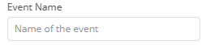

# Integration of Dolibarr to the n8n automation platform

[![CC BY-SA 4.0][cc-by-sa-shield]][cc-by-sa]

## Prerequisites

The following tutorial assumes that you have completed the following prerequisites:

- You have access to an instance of Dolibarr configured to use SSL encryption (with the HTTPS protocol)
- You have access to a user account with administrator rights
- You have activated the "Web Services API REST" module (if it is not already the case, follow the [official documentation](https://wiki.dolibarr.org/index.php/Module_Web_Services_API_REST_(developer)))
- You have obtained an API key for your user account that you will use to test your integration (generated by an administrator, or by the user himself if he has permission to modify his user account information)

When necessary, we will use the following URL to refer to your Dolibarr instance: `https://yourdolibarrurl`. You will have to replace it with the URL of your own Dolibarr instance, without trailing slash.

# Table of Contents

- [Integration of Dolibarr to the n8n automation platform](#integration-of-dolibarr-to-the-n8n-automation-platform)
  - [Prerequisites](#prerequisites)
- [Table of Contents](#table-of-contents)
- [Setting up n8n](#setting-up-n8n)
- [Building a node](#building-a-node)
- [Setting up your environment](#setting-up-your-environment)
- [Node file structure](#node-file-structure)
- [Setting up the project](#setting-up-the-project)
- [Creating the node](#creating-the-node)
  - [Imports](#imports)
  - [Creating the main class](#creating-the-main-class)
  - [Adding node details](#adding-node-details)
  - [Add resources](#add-resources)
  - [Adding operations](#adding-operations)
  - [Hidden fields](#hidden-fields)
  - [Adding optional fields](#adding-optional-fields)
- [Functions](#functions)
- [Setting up authentication](#setting-up-authentication)
- [Adding node metadata](#adding-node-metadata)
- [Testing the node locally](#testing-the-node-locally)
- [Conclusion](#conclusion)
- [Credits](#credits)
- [Licence](#licence)

In n8n, there are two types of nodes: actions and triggers. In this tutorial, we will focus on building a declarative-style action node that creates an event in Dolibarr's agenda module.

# Setting up n8n

As an average user, there are many ways through which you can use n8n. However, as a developer, you need to be able to test your node locally. As a result, this tutorial will assume you will be developing your node on n8n self-hosted through npm.

# Building a node

On this [page](https://docs.n8n.io/integrations/creating-nodes/), you will find a tutorial for creating a node (n8n app integration). This includes :

- An explanation of the different styles to build a node (programmatic or declarative)
- A tutorial for each building style
- A page that lists the different UI elements you will be able to use in your node

From now on, this tutorial will focus on explaining how to build the operation "Create an event" which covers a wide range of what is possible with n8n.

# Setting up your environment

This tutorial assumes you are at least vaguely familiar with JavaScript, TypeScript, and REST APIs. You should also know how to use git : at the very least to be able to publish your node once it is done. Finally, you should know how to create and submit packages on npm.

On your computer, you should have :

- Node.js and npm (minimum version Node 16)
- A local instance of n8n (run `npm install n8n -g` on your terminal to install it)

n8n recommends that you use Visual Studio Code as your IDE
and that you install the following extensions:

- ESLint
- EditorConfig
- Prettier

By using VS Code and these extensions, you get access to the n8n node linter's warnings as you code

# Node file structure

Must be included in your file structure:

- A `package.json` file (necessary for any npm module)
- A `nodes` directory containing all your source files for your node
  - This directory must contain a base file named `<node-name>.node.ts` (in our case, it will be called `Dolibarr.node.ts`)
  - It is recommended to have a codex file, containing metadata for your node and matching the node base file name (`Dolibarr.node.json`)
- A `credentials` directory containing your credentials code (one file per node). In our case, it will be called `Dolibarr.credentials.ts`

Once the node starts to become complicated, n8n recommends the following structure :

- `actions`: directory with description and implementation of each possible resource and operation.
  - In the actions folder, n8n recommends using resources and operations as the names of the sub-folders.
  - For the implementation and description you can use separate files. Use execute.ts and description.ts as filenames. This makes browsing through the code a lot easier. You can simplify this for nodes that have a less complicated structure.
- `methods`: an optional directory dynamic parameters' functions.
- `transport`: a directory containing the communication implementation.

> Should you include more than one node in the npm package, each node should have its own directory in `nodes`

# Setting up the project

The easiest way to start a new project is to generate a repository from the [n8n-nodes-starter template](https://github.com/n8n-io/n8n-nodes-starter/generate), clone your new repository and then delete the following files and directories :

- `nodes/ExampleNode/`
- `nodes/HTTPBin/`
- `credentials/ExampleCredentials.credentials.ts`
- `credentials/HttpBinApi.credentials.ts`

From there, you can create the directory and files necessary for our node:

- `nodes/Dolibarr/`
- `nodes/Dolibarr/Dolibarr.node.ts`
- `nodes/Dolibarr/Dolibarr.node.json`
- `credentials/DolibarrApi.credentials.ts`

Now, install the project dependencies:

```bash
npm i
```

Save the Dolibarr logo as an svg file in the `nodes` folder.

# Creating the node

## Imports

Start by adding the import statement:

```TypeScript
import { INodeProperties, INodeType, INodeTypeDescription } from 'n8n-workflow';
```

## Creating the main class

A node must export an interface that implements `INodeType`. We need to have a `description` interface that contains the `properties` array.

```TypeScript
export class Dolibarr implements INodeType {
    description: INodeTypeDescription = {
        // Basic node details will go here
        properties: [
        // Resources and operations will go here
        ]
    };
}

```

## Adding node details

Now, we add basic parameters such as the display name, the icon, and the basic information for making a request using our node. In `description`, just before `properties`, we add:

```TypeScript
displayName: 'Dolibarr',
name: 'dolibarr',
icon: 'file:dolibarr_logo.svg',
group: [],
version: 1,
subtitle: '={{$parameter["operation"] + ": " + $parameter["resource"]}}',
description: 'Add data to Dolibarr',
defaults: {
    name: 'Dolibarr',
},
inputs: ['main'],
outputs: ['main'],
credentials: [
    {
        name: 'dolibarrApi',
        required: true,
    },
],
requestDefaults: {
    returnFullResponse: true,
    baseURL: '={{$credentials.baseUrl}}/api/index.php',
    headers: {
        Accept: 'application/json',
        'Content-Type': 'application/json',
    },
},
```

Here is what each field does:

- `displayName`, `icon`, `description`, and `subtitle` are used to render the node in the Editor UI
- `version`: the version number of our node
- `defaults`: in case the displayName is too long and is not able to be displayed (in our case, the display name is short enough that we can have the same default name)
- `inputs` and `outputs`: where the node inputs and outputs its data (should be 'main' in most cases)
- `credentials`: the name of our credentials (should match up with the name that will be given in the credentials file)
- `requestDefaults`: what model the HTTP requests will be based upon. In our case, it should match the HTTP requests given when you try out the APIs on swagger.

## Add resources

The resource object defines the API resource that the node uses. Here, we are creating a node that will create an event in the agenda module in a  Dolibarr instance. Update the `properties` array with the resource object:

```TypeScript
properties: [
    // In our case, we should have one resource per Dolibarr module
    {
        displayName: 'Resource',
        name: 'resource',
        type: 'options',
        noDataExpression: true,
        options: [
            {
                name: 'Agenda',
                value: 'agenda',
            },
            // Add as many options as resources
        ],
        default: 'agenda',
    },
    // Operations will go here
]
```

`type` controls which UI element n8n displays for the resource, and tells n8n what type of data to expect from the user. `options` results in n8n adding a dropdown that allows users to choose one option. More informations [here](https://docs.n8n.io/integrations/creating-nodes/build/reference/ui-elements/).

## Adding operations

The operations object defines the available operations on a resource. In our case, we will probably want one operation per available API. For example, for the agenda module, we have 5 different types of APIs:

- GET /agendaevents
- POST /agendaevents
- DELETE /agendaevents{id}
- GET /agendaevents{id}
- PUT /agendaevents{id}

For this tutorial, the one that interests us is POST /agendaevents.
> In a declarative-style node, the operations object includes routing (within the options array). This sets up the details of the API call.

Add the following to the `properties` array, after the resource object (will add an operation):

```TypeScript
{
    displayName: 'Operation',
    name: 'operation',
    type: 'options',
    noDataExpression: true,
    default: 'createEvent',
    displayOptions: {
        show: {
            resource: ['agenda'],
        },
    },

    options: [
        {
            name: 'Create Event',
            value: 'createEvent',
            action: 'Create an event',
            routing: {
                request: {
                    method: 'POST',
                    url: '/agendaevents',
                },
            },
        },
        // Add the other operations for the agenda resource here
    ],
},
```

After that, you can add the following, which will create the fields the user will see in the Editor UI:

```TypeScript
{
    displayName: 'Event Name',
    name: 'label',
    type: 'string',
    default: '',
    placeholder: 'Name of the event',
    required: true,
    displayOptions: {
        show: {
            resource: ['agenda'],
            operation: ['createEvent'],
        },
    },
    routing: {
        send: {
            type: 'body',
            property: 'label',
        },
    },
},
{
    displayName: 'Description',
    name: 'note',
    type: 'string',
    default: '',
    placeholder: 'Description of the event',
    displayOptions: {
        show: {
            resource: ['agenda'],
            operation: ['createEvent'],
        },
    },
    routing: {
        send: {
            type: 'body',
            property: 'note',
        },
    },
},
{
    displayName: 'Event Creator',
    name: 'userownerid',
    type: 'hidden',
    default: '',
    displayOptions: {
        show: {
            resource: ['agenda'],
            operation: ['createEvent'],
        },
    },
    routing: {
        send: {
            preSend: [setUserOwnerId],
        },
    },
},
{
    displayName: 'Event Type',
    name: 'type_code',
    type: 'options',
    default: 'AC_INT',
    placeholder: 'Type of event',
    required: true,
    displayOptions: {
        show: {
            resource: ['agenda'],
            operation: ['createEvent'],
        },
    },
    options: [
        {
            name: 'Intervention on Site',
            value: 'AC_INT',
        },
        {
            name: 'Meetings',
            value: 'AC_RDV',
        },
        {
            name: 'Reception of Email',
            value: 'AC_EMAIL_IN',
        },
    ],
    routing: {
        send: {
            type: 'body',
            property: 'type_code',
        },
    },
},
{
    displayName: 'Beginning Date of Event',
    name: 'start_date',
    type: 'dateTime',
    default: '',
    required: true,
    displayOptions: {
        show: {
            resource: ['agenda'],
            operation: ['createEvent'],
        },
    },
    routing: {
        request: {
            body: {
                datep: '={{$value}}',
            },
        },
        send: {
            preSend: [formatDateP],
        },
    },
},
{
    displayName: 'End Date of Event',
    name: 'end_date',
    type: 'dateTime',
    default: '',
    required: true,
    displayOptions: {
        show: {
            resource: ['agenda'],
            operation: ['createEvent'],
        },
    },
    routing: {
        request: {
            body: {
                datef: '={{$value}}',
            },
        },
        send: {
            preSend: [formatDateF],
        },
    },
},
{
    displayName: 'Email From',
    name: 'email_from',
    type: 'string',
    default: '',
    placeholder: 'Email From',
    displayOptions: {
        show: {
            resource: ['agenda'],
            operation: ['createEvent'],
        },
    },
    routing: {
        send: {
            type: 'body',
            property: 'email_from',
        },
    },
},
{
    displayName: 'Email Subject',
    name: 'email_subject',
    type: 'string',
    default: '',
    placeholder: 'Email Subject',
    displayOptions: {
        show: {
            resource: ['agenda'],
            operation: ['createEvent'],
        },
    },
    routing: {
        send: {
            type: 'body',
            property: 'email_subject',
        },
    },
},
```

Each object corresponds to one user input. Let us explain what each field does using the following example:

```TypeScript
{
    displayName: 'Event Name',
    name: 'label',
    type: 'string',
    default: '',
    placeholder: 'Name of the event',
    required: true,
    displayOptions: {
        show: {
            resource: ['agenda'],
            operation: ['createEvent'],
        },
    },
    routing: {
        send: {
            type: 'body',
            property: 'label',
        },
    },
},
```

This object corresponds to the following user input :



- `displayName` is the label just above the user input box
- `name` is the internal name of the object
- The placeholder is what the user can see before starting to type in the box  
- In `displayOptions` you should put the values for which that user input is shown. In this case, the user input for the name of an event will only appear is the user hase selected the `agenda` resource and the `createEvent` operation.
- In `routing`, you deal with how your HTTP request will be built. In our case, we will send an HTTP request with a JSON `body` and the user input will be associated with the field label (given by the `property` field).
- `type` is the [Node UI element](https://docs.n8n.io/integrations/creating-nodes/build/reference/ui-elements/)

## Hidden fields

You might have noticed that in the [Add Resources section](#add-resources), we are missing a field for `userownerid` that is a mandatory field when making the API request. However, an average user would have no way of knowing his user id on Dolibarr. That is why we hid the user input and fill it in automatically. Add this object after all the others:

```TypeScript
{
    displayName: 'Event Creator',
    name: 'userownerid',
    type: 'hidden',
    default: '',
    displayOptions: {
        show: {
            resource: ['agenda'],
            operation: ['createEvent'],
        },
    },
    routing: {
        send: {
            preSend: [setUserOwnerId],
        },
    },
},
```

Its value is set before being sent (hence the `preSend` field) in a function called `setUserOwnerId` found in another file. More about this in [Functions section](#functions).

## Adding optional fields

If you want your node to have optional fields, you can do so easily and n8n will display those under Additional Fields in the UI. To add an additional field, it should look like this:

```TypeScript
{
    displayName: 'Additional Fields',
    name: 'additionalFields',
    type: 'collection',
    default: {},
    placeholder: 'Add Field',
    displayOptions: {
        show: {
            resource: [
                'agenda',
            ],
            operation: [
                'createEvent',
            ],
        },
    },
    options: [
        {
            displayName: '____',
            name: '____',
            type: '____',
            default: '',
            routing: {
                // What you want to do for routing
            },
        },
    ],
}
```

# Functions

The declarative-style for creating nodes is really easy to use but you might want to do some more complex things such as pre-filling a field before sending the HTTP request. This is done by creating functions that you can then use in your object (for instance the object handling the `userownerid` field in the API). Let us take a look as how that function (`setUserOwnerId`) works:

```TypeScript
export async function setUserOwnerId(this: IExecuteSingleFunctions, requestOptions: IHttpRequestOptions): Promise<IHttpRequestOptions> {
	const responseData = await apiRequest.call(this, 'GET', 'users/info');
	if (requestOptions.body != undefined) {
		Object.assign(requestOptions.body, { userownerid: responseData.id });
	}
	return requestOptions;
}
```

This function takes the HTTP request options that would have been sent on the API call as an argument. In the body of the function, we aim to modify the body of the HTTP request. First, through a separate API call, we get the user ID. Then, after checking that `requestOptions.body` is not `undefined`, we set `userownerid` to the value that was received from the API call. Lastly, we return the HTTP request options that were modified.

You might have noticed that the biggest part of that function is done by `apiRequest.call`. The code for `apiRequest` can be found below:

```TypeScript
export async function apiRequest(
	this: IHookFunctions | IExecuteFunctions | ILoadOptionsFunctions | IExecuteSingleFunctions,
	method: IHttpRequestMethods,
	endpoint: string,
	body: IDataObject | GenericValue | GenericValue[] = {},
	query: IDataObject = {},
): Promise<any> {
	query = query || {};

	type DolibarrApiCredentials = {
		apiKey: string;
		baseUrl: string;
	};

	const credentials = (await this.getCredentials('dolibarrApi')) as DolibarrApiCredentials;

	const options: IHttpRequestOptions = {
		method,
		body,
		qs: query,
		url: `${credentials.baseUrl}/api/index.php/${endpoint}`,
		headers: {
			'content-type': 'application/json',
		},
	};

	try {
		return this.helpers.httpRequestWithAuthentication.call(this, 'dolibarrApi', options);
	} catch (error) {
		if (error instanceof NodeApiError) {
			throw error;
		}
		throw new NodeApiError(this.getNode(), error as JsonObject);
	}
}
```

This function is rather simple as well. We define a type for our credentials and we retrieve them. We define the HTTP request options and then use the helper function from n8n to return the result of an HTTP request with authentication.

# Setting up authentication

As you might remember, we created a `DolibarrApi.credentials.ts` file earlier in the beginning of this tutorial. Head to that file and add the following:

```TypeScript
import type {
    ICredentialType,
    INodeProperties,
    IAuthenticateGeneric,
    ICredentialTestRequest,
} from 'n8n-workflow';

export class DolibarrApi implements ICredentialType {
    name = 'dolibarrApi';

    displayName = 'Dolibarr API';

    properties: INodeProperties[] = [
        {
            displayName: 'Base URL',
            name: 'baseUrl',
            type: 'string',
            required: true,
            default: '',
            placeholder: 'https://yourdolibarrurl',
        },
        {
            displayName: 'API Key',
            name: 'apiKey',
            type: 'string',
            required: true,
            typeOptions: { password: true },
            default: '',
        },
    ];

    authenticate: IAuthenticateGeneric = {
        type: 'generic',
        properties: {
            headers: {
                DOLAPIKEY: '={{$credentials.apiKey}}',
            },
        },
    };

    test: ICredentialTestRequest = {
        request: {
            baseURL: '={{$credentials.baseUrl}}/api/index.php',
            url: '/users/info',
            method: 'GET',
        },
    };
}

```

- `name`: internal name of the object, notably used in the `Dolibarr.node.ts` to access the credentials.
- `documentationUrl`: link to credentials documentation.
- `properties`: fields we want the user to fill in to authenticate themselves. In our case, that is the base URL to their Dolibarr instance and the API key associated with their user profile.
- `authenticate`: how to inject the authentication data as part of the API request. In our case, we need a `DOLAPIKEY` in the headers.
- `test`: how n8n checks that the credentials input are correct.
- more information [here](https://docs.n8n.io/integrations/creating-nodes/build/reference/credentials-files/).

# Adding node metadata

This is what you need to add to the `Dolibarr.node.json` file:

```JSON
{
    "node": "n8n-nodes-base.Dolibarr",
    "nodeVersion": "1.0",
    "codexVersion": "1.0",
    "categories": [
        "Miscellaneous"
    ],
    "resources": {
        "credentialDocumentation": [
            {
                "url": ""
            }
        ],
        "primaryDocumentation": [
            {
                "url": ""
            }
        ]
    }
}
```

In the resources, we should have link to the necessary documentation so that n8n can automatically add help links.

# Testing the node locally

1. Make sure you have installed n8n. If not, you can run

   ```bash
   npm install n8n -g
   ```

2. Publish your node locally:

   ```bash
    # In your node directory
    npm run build
    npm link
   ```

   You can also run  

   ```bash
    npm run dev
   ```

   So that your node will be built each time you make a change
3. Install the node into your local n8n instance:

    ```bash
    npm list -g
    ```

    Should give you something like this

    > $HOME/.nvm/versions/node/v18.14.0/lib  
    > ├── corepack@0.15.3  
    > ├── n8n@0.218.0  
    > ├── npm@9.5.1  
    > └── uuid@9.0.0  

    Do the following to create a link between your local node and the nodes directory within your n8n installation:

    ```bash
    cd <first line of previous command>/node_modules/n8n
    npm link <node-package-name>
    ```

4. Start n8n

   ```bash
   n8n start
   ```

5. Open n8n in your browser. You should be able to find your node when you search for them in the nodes panel (just type Dolibarr).

# Conclusion

This tutorial helped you build an n8n node that will create an event in Dolibarr. You can find the rest of the node being built [here](https://github.com/Dolibarr/dolibarr-integration-resources).

# Credits

This tutorial was produced by the [AuTEAMation](https://github.com/AuTEAMation) team as part of the design of interfacing prototypes between the Dolibarr ERP/CRM and several automation platforms for [DoliCloud](https://www.dolicloud.com/). This study was carried out as part of the PFA, a 2nd year group project at [ENSEIRB-MATMECA](https://enseirb-matmeca.bordeaux-inp.fr).

# Licence

This tutorial is licensed under a
[Creative Commons Attribution-ShareAlike 4.0 International License][cc-by-sa].

[![CC BY-SA 4.0][cc-by-sa-image]][cc-by-sa]

[cc-by-sa]: http://creativecommons.org/licenses/by-sa/4.0/
[cc-by-sa-image]: https://licensebuttons.net/l/by-sa/4.0/88x31.png
[cc-by-sa-shield]: https://img.shields.io/badge/License-CC%20BY--SA%204.0-lightgrey.svg
