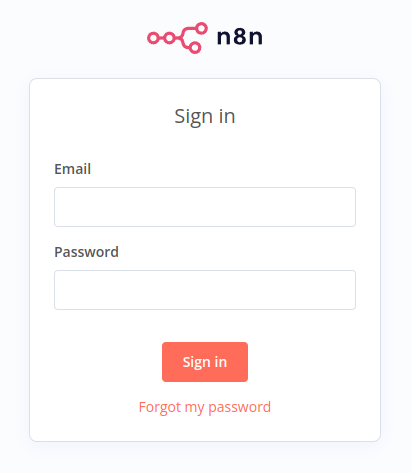
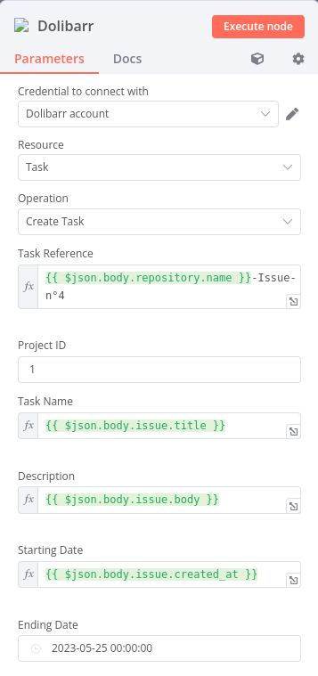

# Usage of Dolibarr the n8n automation platform

[![CC BY-SA 4.0][cc-by-sa-shield]][cc-by-sa]

## Prerequisites

The following tutorial assumes that you have completed the following prerequisites:

- You have access to an instance of Dolibarr configured to use SSL encryption (with the HTTPS protocol),
- You have access to a user account with rights to use some specific modules such as Calendar, Project or Documents,
- You have obtained an API key for your user account that you will use to test your integration (generated by an administrator, or by the user himself if he has permission to modify his user account information).

When necessary, we will use the following URL to refer to your Dolibarr instance: `https://yourdolibarrurl`. You will have to replace it with the URL of your own Dolibarr instance, without trailing slash.

# Table of Contents

- [Usage of Dolibarr the n8n automation platform](#usage-of-dolibarr-the-n8n-automation-platform)
  - [Prerequisites](#prerequisites)
- [Table of Contents](#table-of-contents)
- [Connecting to n8n](#connecting-to-n8n)
- [Creating a Workflow using Dolibarr Node](#creating-a-workflow-using-dolibarr-node)
- [Explanation of the different functionalities](#explanation-of-the-different-functionalities)
    - [General informations](#general-informations)
        - [Credentials](#credentials)
        - [Fields in every node](#fields-in-every-node)
    - [Creating a Calendar Event](#creating-a-calendar-event)
        - [Creating an event in Calendar when an event is created in Google Calendar](#creating-an-event-in-calendar-when-an-event-is-created-in-google-calendar)
        - [Creating an event in Calendar when an email is received](#creating-an-event-in-calendar-when-an-email-is-received)
    - [Creating a document](#creating-a-document)
        - [Add a document in Dolibarr Document Gestion containing Zoom meeting information](#add-a-document-in-dolibarr-document-gestion-containing-zoom-meeting-information)
    - [Creating a Project Task](#creating-a-project-task)
        - [Creating a Task in Dolibarr when a Github issue is received](#creating-a-task-in-dolibarr-when-a-github-issue-is-received)
- [Conclusion](#conclusion)

# Connecting to n8n

As explained in previous parts, once you have created your n8n self-hosted instance on your computer and started it with the command:

```bash
n8n start
```

or

```bash
n8n
```

Then you just have to press `o` on your terminal to open n8n in your browser.

You should arrive to the following connexion screen where you can enter your connexion informations.



# Creating a Workflow using Dolibarr Node

When you have signed in, you can create you first Workflow and selected the Dolibarr node.

To do that, you just have to click on `Add Workflow` to create one and click on the `+` to add a node to your Workflow. It will open a search bar in which you can search `dolibarr` to find it.


# Explanation of the different functionalities


Here are the different Dolibarr functionalities we have implemented in n8n.

## General informations

## Credentials

A Dolibarr node needs to have set up credentials in order to connect your Dolibarr instance to n8n.

You can connect to your Dolibarr account from the `Credentials` tab or directly from a Dolibarr node.


You have to indicate you base URL which is your instance URL.

And your API key that you can find in your account parameters when connected in Dolibarr.

## Fields in every node


For every Dolibarr node there will be some fields that will be the same.

These fields are the first three one on the picture below:

- `Credential to connect with`  : this is where you can set your `credentials` as explained just before,
- `Resource` : this is where you choose which module of Dolibarr will be affected, there are 4 options : Calendar, Task, Document and Custom API Call (use this one only if you know what you are doing),
- `Operation` : this is in this field where you select the kind of operation you want to do on this specific resource, for now it only supports creation operation.

## Creating a Calendar Event

The first node is used to create an event in the calendar in Dolibarr.


If you have selected the `Create an Event` operation and have alreary set your credentials the first three fields will be already completed.

For the next fields:

- `Event Name` corresponds with the `Label` field in Dolibarr interface (this field is required),
- `Description` corresponds with the `Description` field (this field is optional),
- `Event Type` corresponds with the `Type` type field, three options are available : `Intervention on site`, `Meetings` and `Reception of Email` (this field is required),
- `Beginning Date of Event` corresponds with the left date in the `Date` field (this field is required),
- `End Date of Event` corresponds with the right date in the `Date` field (this field is required),
- `Email From` is not corresponding to any field for now on Dolibarr but since this field is present in Dolibarr API, it is possible that is the next updates a dedicated Mail Sender field will be available on the Dolibarr interface (this field is optional),
- `Email Subject` is also not corresponding to any field for now on Dolibarr and as the previous one we can expect that a dedicated field appears is the next updates (this field is optional).


## Creating an event in Calendar when an event is created in Google Calendar

To produce this use case you will have to connect a `Google Calendar Trigger node` on the `Dolibarr node`.

The `Google Calendar Trigger node` documentation can be found [here](https://docs.n8n.io/integrations/builtin/trigger-nodes/n8n-nodes-base.googlecalendartrigger/).

Once you have set up the `Google Calendar Trigger node` you can connect it to the `Dolibarr Create an event node`.


One possible configuration to have the wanted informations is to enter to same informations as in the screenshot.

Be sure to select `Expression` mode on fields that use the previous node informations.

You can either type or drag and drop from the left window which field you want to have from the Google Calendar Event.

Here:

- `{{ $json.summary }}` corresponds to the Google Caldendar Event Name,
- `{{ $json.htmlLink }}` corresponds to the Google Caldendar event URL (doing this is optional since description can be empty as explained before, entering the URL only facilitate the Google Calendar event access from Dolibarr),
- `{{ $json.start.dateTime }}` corresponds to the starting time of the Google Calendar event,
- `{{ $json.end.dateTime }}` corresponds to the ending time of the Google Calendar event.

## Creating an event in Calendar when an email is received

To produce this use case you will have to connect an `Email Trigger node` on the `Dolibarr node`, for example the `Email Trigger (IMAP) node` or the `Gmail Trigger node`.

The `Email Trigger (IMAP) node` documentation can be found [here](https://docs.n8n.io/integrations/builtin/core-nodes/n8n-nodes-base.emailimap/) and the `Gmail Trigger node` one [here](https://docs.n8n.io/integrations/builtin/trigger-nodes/n8n-nodes-base.gmailtrigger/).

As before, when you have set up the trigger node you can connect it to the `Dolibarr Create an event node`.


For the example of configuration, this is the `Email Trigger node` case that will be presented since it is the more general case. One possible configuration to have the wanted informations is to enter to same informations as the screenshot.

Be sure to select `Expression` mode on fields that use the previous node informations.

You can either type or drag and drop from the INPUT window on the left which field you want to have from the received mail.

Here:

- `{{ $json.subject }}` corresponds to the subject of the mail,
- `{{ $json.textPlain }}` corresponds to the email sender,
- `{{ $json.from }}` corresponds to the body of the email,
- `{{ $json.date }}` corresponds to the date when the email was sent.

The `Gmail Trigger node` will be similar, you can find the desired field using the INPUT window on the left in `Schema` mode to help yourself.


The second screenshot correspond to a possible configuration of the `Dolibarr Create an event Node` with the `Email Trigger (IMAP) node` when the `Email From` and `Email Subject` fields will be implemented in the Dolibarr interface in future updates.

## Creating a document

The second node is used to create a document on a specific Dolibarr module.


If you have selected `Create a document` and have alreary set your credentials the first two fields will be already completed.

For the next fields:

- `File Name` corresponds to the file name is Dolibarr, it is important not to forget the file extension if you want it to have one (this field is required),
- `Module Name` corresponds to the Dolibarr module where the file will be created (this field is required),
- `Reference` corresponds to the `Ref.` of the object to which the file will be linked (this field is required),
- `File Content` corresponds to the content that will be written in the file (this field is optional),
- `File Encoding` is an additionnal field that needs to be activated if you want to add file with formatting, like pdf which needs to be encoded in base64 (this field is optional),
- `Overwrite File if It Already Exists ?` is an additionnal field that when activated will allow file overwriting if the File Name entered already exists (this field is optional),
- `Create Subdirectories if Necessary ?` is an additionnal field that when activated creates a Subdirectory for your file if this is necessery (this field is optional).

## Add a document in Dolibarr Document Gestion containing Zoom meeting information

To produce this use case you will have to connect an `Zoom Get Meeting node` on the `Dolibarr node` with a `n8n Trigger node` at the beggining of the workflow.

The `Zoom node` documentation can be found [here](https://docs.n8n.io/integrations/builtin/app-nodes/n8n-nodes-base.zoom/).

As before when have set up the node you can connect it to the `Dolibarr Create an event node`.


One possible configuration to have a Zoom meeting informations is to enter to same informations as on the screenshot.

Be sure to select `Expression` mode on fields that use the previous node informations.

You can either type or drag and drop from the `INPUT` window on the left which field you want to have from the received mail.

Here:

- `{{ $json.topic }}` corresponds to the topic of the Zoom meeting,
- `{{ $json.host_email }}` corresponds to the email of the person who host the Zoom meeting,
- `{{ $json.duration }}` corresponds to the duration of the Zoom metting,
- `{{ $json.timezone }}` corresponds to the time zone where was done the Zoom metting.

Besides, a .docx file extension is added to generate a file compatible with LibreOffice Writer, this format does not need `File Encoding`.

This file will be added to the Agenda Event associated with the Zoom meeting, in the example this is the event with the `Reference` n°33.

Finally, the additional Field `Overwrite File If Already Exists ?` is activated to be able ot overwrite the file with more or different informations  from the Zoom meeting if wanted.

## Creating a Project Task

The third node is used to create a task in the project module of Dolibarr.


If you have selected `Create a Task` and have alreary set your credentials the first three fields will be already completed.

For the next fields:

- `Task Reference` corresponds with the `Ref.` field in Dolibarr interface, the `Task Reference` is a `string` that must be unique, (this field is required),
- `Project ID` corresponds with the `Child of project` field, this is a number corresponding to the id of the project from which the task will be a child (this field is required),
- `Task Name` corresponds with the `Label` field (this field is required),
- `Description` corresponds with the `Description` field (this field is optional),
- `Starting Date` corresponds with the left date in the `Date` field (this field is required),
- `Ending Date` corresponds with the right date in the `Date` field (this field is optional).


## Creating a Task in Dolibarr when a Github issue is received

To produce this use case you will have to connect a `Github Trigger node` on the `Dolibarr node`.

It is important here if you are using a self-hosted instance of n8n to start it in tunnel mode. To do so, just run the following command:

```bash
n8n start --tunnel
```

To trigger on receiving issues select the type `Issues` in the `Events` field.

The `Github Trigger node` documentation can be found [here](https://docs.n8n.io/integrations/builtin/trigger-nodes/n8n-nodes-base.githubtrigger/).

Once you have set up the `Github Trigger node` you can connect it to the `Dolibarr Create a task node`.



One possible configuration to have the wanted informations is to enter to same informations as on the screenshot.

Be sure to select `Expression` mode on fields that use the previous node informations.

You can either type or drag and drop from the left window which field you want to have from the Github Issue.

Here:

- `{{ $json.body.repository.name }}` corresponds to the name of the Github repository,
- `{{ $json.body.issue.title }}` corresponds to the title of the issue,
- `{{ $json.body.issue.body }}` corresponds to comment leave on the issue,
- `{{ $json.body.issue.created_at }}` corresponds to the creation date of the issue.

# Conclusion

This tutorial helped you understand how to configure a Dolibarr node in n8n and how they work in order to make you build the example use cases or custom use cases using already existing Dolibarr node functionalities.

# Credits

This tutorial was produced by the [AuTEAMation](https://github.com/AuTEAMation) team as part of the design of interfacing prototypes between the Dolibarr ERP/CRM and several automation platforms for [DoliCloud](https://www.dolicloud.com/). This study was carried out as part of the PFA, a 2nd year group project at [ENSEIRB-MATMECA](https://enseirb-matmeca.bordeaux-inp.fr).

# Licence

This tutorial is licensed under a
[Creative Commons Attribution-ShareAlike 4.0 International License][cc-by-sa].

[![CC BY-SA 4.0][cc-by-sa-image]][cc-by-sa]

[cc-by-sa]: http://creativecommons.org/licenses/by-sa/4.0/
[cc-by-sa-image]: https://licensebuttons.net/l/by-sa/4.0/88x31.png
[cc-by-sa-shield]: https://img.shields.io/badge/License-CC%20BY--SA%204.0-lightgrey.svg