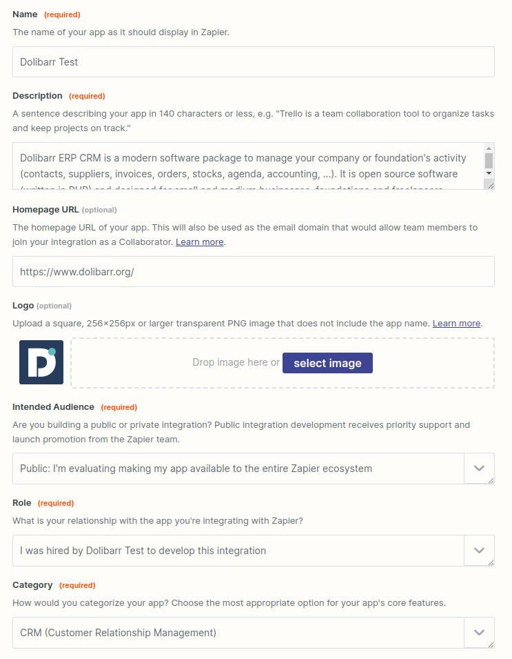

# Integration of Dolibarr to the Zapier automation platform
[![CC BY-SA 4.0][cc-by-sa-shield]][cc-by-sa]

## Preamble

There are two ways to create an integration for Zapier: using the Zapier CLI or using the Zapier Platform Visual Builder. By starting to create an integration with the Zapier Platform Visual Builder, you can then export your integration and import it into the Zapier CLI for editing and publishing. But once you start using the Zapier CLI, you will no longer be able to use the Zapier Platform Visual Builder to modify your integration. In this tutorial, we will start by using the Zapier Platform Visual Builder, but the project was exported in the Zapier CLI and you can find it in the [code](./code) folder.

## Prerequisites

The following tutorial assumes that you have completed the following prerequisites:
* You have access to an instance of Dolibarr configured to use SSL encryption (with the HTTPS protocol)
* You have access to a user account with administrator rights
* You have activated the "Web Services API REST" module (if it is not already the case, follow the [official documentation](https://wiki.dolibarr.org/index.php/Module_Web_Services_API_REST_(developer)))
* You have obtained an API key for your user account that you will use to test your integration (generated by an administrator, or by the user himself if he has permission to modify his user account information)

When necessary, we will use the following URL to refer to your Dolibarr instance: `https://yourdolibarrurl`. You will have to replace it with the URL of your own Dolibarr instance, without trailing slash.

# Create the Zapier integration

Start by accessing the Zapier Platform Visual Builder at the following address: <https://developer.zapier.com/>.

If you don't already have a Zapier account, you'll need to create one. Once logged in, you should land on the Zapier Platform Visual Builder home page. Click the "Start a Zapier Integration" button to begin.

You will be asked for different information:
* a name for your integration
* a description
* a website URL
* a logo
* the audience targeted by your integration (public or private)
* your role in the development of the integration (employee, hired, independent)
* the category of your integration



You can find more information on the [official documentation](https://platform.zapier.com/quickstart/create-integration).

# Configure authentication

Once you've created your integration, you'll land on its dashboard. In the "Authentication" section, click on the "Set Up Authentication" button.

You will be offered several authentication methods (API Key, OAuth v2, Session Auth, Basic Auth, Digest Auth...). In our case, we will use the "Session Auth" method.

> **Note:** Although the "API Key" method seems to correspond better to the use of the Dolibarr API (since it requires an API key), the connection data is fixed and would require the user specifies its user ID in the Dolibarr database upstream, so that it can then be used in other actions. With the "Session Auth" method, we simply retrieve the user's identifier at the first connection, which can then be used in other actions.

## Step 1: Configuring Authentication Fields

In the first step, click on the "Add Field" button to add a first field with the following information:

| Field      | Value                                                                                                              |
|------------|--------------------------------------------------------------------------------------------------------------------|
| Field Type | `Field`                                                                                                            |
| Label      | `Instance URL`                                                                                                     |
| Key        | `host`                                                                                                             |
| Required   | ✅ Yes                                                                                                             |
| Type       | String                                                                                                             |
| Help Text  | `Specify the base address of the Dolibarr instance, it must not have "/" at the end and must start with https://.` |

Leave the other fields blank.

Then add a second field with the following information:

| Field      | Value                                                                                      |
|------------|--------------------------------------------------------------------------------------------|
| Field Type | `Field`                                                                                    |
| Label      | `API Key`                                                                                  |
| Key        | `api_key`                                                                                  |
| Required   | ✅ Yes                                                                                     |
| Type       | Password                                                                                   |
| Help Text  | `Specify the API key associated with the Dolibarr account to use through the integration.` |

Leave the other fields blank.

## Step 2: Configuring the token exchange request

In the second step, you need to configure the token exchange request. In the case of Dolibarr, there is no notion of token, but we will use this request to retrieve the identifier of the user who connects (see note above) as well as his first and last name (for display in Zapier).

The Zapier interface offers a "simple" mode where all you have to do is enter the URL of the request and the parameters to send, but that is not enough in our case. We will use the "advanced" mode by clicking on the "Switch to Code Mode" button.

Paste the following code in it:

```javascript
const options = {
  url: `${bundle.authData.host}/api/index.php/users/info`,
  method: 'GET',
  headers: {
    'DOLAPIKEY': bundle.authData.api_key
  }
}

return z.request(options)
  .then((response) => {
    response.throwForStatus();
    const results = response.json;

    return {
      'id': results.id,
      'firstname': results.firstname,
      'lastname': results.lastname,
    };
  });
```

> **Note:** From the data that will be entered by the user in the authentication fields (`host` and `api_key`) and accessible via `bundle.authData`, we build the URL of the Dolibarr API, then we make a GET request on the URL `/api/index.php/users/info` with the header `DOLAPIKEY` containing the API key. We then retrieve the user's data (his identifier, first name and last name) and send them back to Zapier to make them available in other actions.

Once the code has been pasted, click on the "Save & Continue" button to go to the next step.

## Step 3: Configuring the test request

In the third step, you need to configure the test query. This request is used by Zapier to verify that the information entered by the user is correct. In our case, we will simply make a GET request on the URL `/api/index.php/users/info` with the header `DOLAPIKEY` containing the API key.

As before, click on the "Switch to Code Mode" button and paste the following code into it:

```javascript
const options = {
  url: `${bundle.authData.host}/api/index.php/users/info`,
  method: 'GET',
  headers: {
    'DOLAPIKEY': bundle.authData.api_key
  }
}

return z.request(options)
  .then((response) => {
    response.throwForStatus();
    const results = response.json;

    return results;
  });
```

You will then have to specify a "Connection Label", which will be displayed to the user when he connects to his Dolibarr account from Zapier. For example, you can use the first and last name of the user, or the name of the Dolibarr instance. By imagining that the user is called "John Doe" and that the Dolibarr instance is available at the address `https://yourdolibarrurl`, you can use the following value: `{{bundle.authData.firstname}} {{bundle.authData.lastname}}({{bundle.authData.host}})` which will show `John Doe (https://yourdolibarrurl)`.

Then click on the "Save & Continue" button to go to the next step.

## Step 4: Testing the connection

In the fourth step, you need to test the connection to Dolibarr. Click on the "Add a New Account" button.

A window will open and ask you to enter the authentication information configured in step 1, i.e. the URL of the Dolibarr instance and the API key of the user.


Once the information has been entered, click on the "Yes, Continue to ..." button.

If all went well, you should see your account appear in the list of available accounts.

Then click on the "Test Authentication" button to check that the connection is working properly. If everything went well, you should see the result of the test query configured in step 3, i.e. the user information returned by the `/api/index endpoint. php/users/info`:
```json
{
  "id": "10",
  "login": "jdoe",
  "lastname": "Doe",
  "firstname": "John",
  // And many more...
}
```

All you have to do is click on the "Save & Finish" button to complete the authentication configuration.

The different authentication configuration data is available in the file [code/authentication.js](./code/authentication.js), exported from Zapier CLI.

# Create a trigger

Creating a trigger is more complex than creating an action. Indeed, a trigger must be able to retrieve data from an event that occurs in Dolibarr and send it to Zapier.

Dolibarr offers a "webhook" system that allows data to be sent to a given URL when an event occurs, but it is not yet fully adapted to setting up a trigger in Zapier. So we won't cover in this part in the tutorial, but all contributions about it are welcome.

# Create an action
* **Example case:** Create an event in the Dolibarr calendar
* **Prerequisites:** Have activated the "Events/Agenda" module in Dolibarr and given the necessary permissions to the user to create an event in his name

Actions allow to perform operations in Dolibarr, in reaction to an event that occurs in another application. For example, you can create an action that allows to create an event in the Dolibarr calendar when an event is created in Google Calendar. It is this use case that we will cover in this part of the tutorial.

From the integration dashboard on Zapier, click on the "Add Action" button in the "Actions" section.

## Step 1: Configuring the action

In the first step, you need to configure the action. To do this, you must give it a name and a description. This information will be displayed to the user when they use the action in a zap. Fill in the fields as follows (you can of course use the values of your choice depending on the action you want to create):

| Field              | Value                                                  |
|--------------------|--------------------------------------------------------|
| Type               | Create                                                 |
| Key                | `create_event`                                         |
| Name               | `Create an event`                                      |
| Noun               | `Event`                                                |
| Description        | `Create an event in the Dolibarr calendar`             |
| Visibility Options | Important (Displayed above the fold in the Zap Editor) |

Once the fields are filled in, click on the "Save" button and go to the next step.

## Step 2: Configuring the fields

In the second step, you need to configure the action fields. These fields allow the user to enter the information needed to perform the action. In our case, we are going to create an action which allows to create an event in the Dolibarr calendar. We will therefore need the following fields: a name, a start date, an end date, a place and a description. Many other fields are available, but we will limit ourselves to these 5 fields for this example.

Click the "Add" > "Input Field" button to add a field. Fill in the fields as follows, then click the "Save" button:

| Field       | Label         | Key            | Type     | Required |
|-------------|---------------|----------------|----------|----------|
| Name        | `Event name`  | `label`        | String   | ✅ Yes   |
| Start date  | `Start date`  | `datep`        | DateTime | ✅ Yes   |
| End date    | `End date`    | `datef`        | DateTime | ❌ No    |
| Location    | `Location`    | `location`     | String   | ❌ No    |
| Description | `Description` | `note_private` | Text     | ❌ No    |

> **Note:** The field keys are deliberately the same as the keys used by the Dolibarr API to identify the fields. Often poorly documented, they can be found in the source code of Dolibarr, or directly in the database. You can also create a resource from Dolibarr then retrieve it via the API (use the API explorer at <https://yourdolibarrurl/api/index.php/explorer/> or a tool like Postman to test the requests to the API) to identify the field keys based on the data you entered.

Once all the fields have been created, you should see a summary table of the action fields and a preview of the data entry form similar to this:


## Step 3: API configuration

In the third step, you need to configure the request to the Dolibarr API, in three substeps:

### API request configuration

In the first sub-step, you need to fill in the basic request information to the API. As for the authentication configuration, switch to "code" mode by clicking on the "Switch to Code Mode" button, then paste the following code:

```js
const options = {
  url: `${bundle.authData.host}/api/index.php/agendaevents`,
  method: 'POST',
  headers: {
    'Content-Type': 'application/json',
    'Accept': 'application/json',
    'DOLAPIKEY': bundle.authData.api_key
  },
  body: JSON.stringify({
    'type_id': "50",
    'userownerid': bundle.authData.id,
    'label': bundle.inputData.label,
    'datep': Date.parse(bundle.inputData.datep) / 1000,
    'datef': Date.parse(bundle.inputData.datef) / 1000,
    'location': bundle.inputData.location,
    'note_private': bundle.inputData.note_private
  })
}

return z.request(options)
  .then((response) => {
    response.throwForStatus();
    const results = response.json;

    return {id: results};
  });
```

> **Note:** The code above is to be adapted according to the fields you created in the previous step. For strings, you can directly use user-entered values via `bundle.inputData`. For dates, you need to use `Date.parse()` to convert the date entered by the user into timestamp (in milliseconds in JavaScript), then divide by 1000 to get a timestamp in seconds (Dolibarr API expects a timestamp in seconds). Some fields take "hard" numeric values, such as `type_id`, which will then have to be discovered by exploring the Dolibarr API. Finally, for the `userownerid` field, we use `bundle.authData.id`, which was automatically populated by Zapier with the user ID when the user configured their Dolibarr account in Zapier.

### Testing the request to the API

In the second sub-step, you need to test the request to the API. To do this, choose the Dolibarr account to use (like the one connected when configuring authentication) or add a new one. Then fill in the fields with test values, then click the "Test Your Request" button:

| Field       | Value                      |
|-------------|----------------------------|
| label       | `Test event`               |
| datep       | `2023-05-01T16:00:00.000Z` |
| datef       | `2023-05-01T18:00:00.000Z` |
| location    | `Test room`                |
| note_private| `This is a test event`     |

> **Note:** When testing or creating a "Zap" (user scenario), Zapier only offers text fields, nothing more. For dates, you must therefore enter a date in one of the supported formats ([see here](https://help.zapier.com/hc/en-us/articles/8496259603341#date-time-fields-0-0 )), for example in ISO 8601 format (`2023-05-01T16:00:00.000Z` for May 1, 2023 at 4:00 PM UTC). When using your action in a workflow, Zapier will also offer data fields from the triggering application, more often suited to the data types you defined in the previous step.

If everything goes well, you should see a success message and a preview of the data returned by the Dolibarr API, in this case, the identifier of the event created:
```json
{
  "id": 86
}
```

### Configuration of the data returned by the API

In the third substep, you need to configure the data returned by the API. This is to tell Zapier what the data returned by the API corresponds to, to then possibly be reused in other scenarios. In our case, we will simply indicate that the identifier of the created event corresponds to the identifier of the event created by the Dolibarr API. To do this, simply click on the "Use Response from Test Data" button, then "Generate Output Field Definitions". You should then see an `id` field appear in the list of output fields, give it the description `ID of the event created`.

All you have to do is click on the "Save Output & Finish" button to complete the configuration of your action.

## Step 4: Testing the action in a "Zap"

Now that your action is configured, you can use it in a "Zap" (user scenario). To do this, go to the [Zapier user dashboard](https://zapier.com/app/zaps) and click on the "Create" > "New Zap" button.

### Trigger setup

In the first step, you must configure the "trigger" of your scenario. In our case, we are going to use the "Google Calendar" > "New Event" trigger, which lets you trigger the scenario when a new event is created in a Google Calendar. Click the "Continue" button.

In the second step, you need to configure the Google account to use. Click the "Connect a new account" button (or select an existing account), then follow the instructions to connect your Google Calendar account to Zapier. Once the account is connected, click on the "Continue" button.

In the third step, you need to configure the Google Calendar to monitor. Click the "Continue" button.

In the fourth and last step, you can test the trigger by clicking on the "Test trigger" button. This will look for an event in the selected Google Calendar and use it to test the rest of the scenario. If all goes well, you should see a success message and a preview of the data returned by the trigger. Click the "Continue" button.

### Action Setup

In the first step, you need to configure the action of your scenario. In our case, we are going to use the "Dolibarr" > "Create Event" action, which we created earlier. This will appear with the mention "By invite", because it is not yet published. If you don't see it, make sure you're using the same Zapier account you used to create the action. If you want to use an action created but not published by another Zapier account, you can invite that account to collaborate on your Zapier app (see [here](https://platform.zapier.com/private_integrations/share-your-private-integration)). Click the "Continue" button.

In the second step, you need to configure the Dolibarr account to use. Click on the "Connect a new account" button (or select an existing account), then follow the instructions to connect your Dolibarr account to Zapier. Once the account is connected, click on the "Continue" button.

In the third step, you need to configure the data to provide to the action. To do this, you can use the data returned by the trigger, by clicking on a field and selecting the corresponding field in the list of data. In our case, we will use the following data:

| Field       | Google Calendar field      |
|-------------|----------------------------|
| Event name  | Summary                    |
| Start date  | Event begins (pretty)      |
| End date    | Event ends (pretty)        |
| Location    | Location                   |
| Description | Description                |

Click the "Continue" button.

In the fourth step, you can test the action by clicking the "Test action" button. This will create an event in Dolibarr, with a copy of the Google Calendar event data. If all goes well, you should see a success message and a preview of the created event ID.


All you have to do is click on the "Publish" button and "Turn Zap on" to activate your scenario.

> **Note:** Some services like Gmail or Google Drive cannot be used in a Zapier scenario until the integration is published and validated. So you will be able to test your scenario, but when publishing you will get an error message. To work around this problem, you can for example use the "Code by Zapier" > "Run Javascript" action before the Dolibarr action, simply returning the trigger data to make it available in the Dolibarr action. Alternatively, you can publish your integration and have it validated.

The different action configuration data is available in the file [code/creates/create_event.js](./code/creates/create_event.js), exported from Zapier CLI. Similarly, you will find other sample actions in the [code/creates](./code/creates) folder.

# Validate and publish the integration

The final step is to validate and publish the integration. This step is necessary to be able to use the integration with other accounts than the one used to create it without having to invite them to collaborate on the Zapier application.

This part will not be covered in this tutorial, because it requires having the rights to the Dolibarr application or to the domain name of the organization (more information [here](https://platform.zapier.com/partners/integration-review-guidelines#21-integration-ownership)).

# Go further

Many other features are available in Zapier, such as the "search" actions, which allow you to list data in a third-party application in order to use it in a programmed scenario or executed via an external trigger. As seen above, it is possible to create triggers, but this will probably have to wait for better management of webhooks in Dolibarr. Finally, although Dolibarr already offers many APIs, some features are not yet available.

# Conclusion

Zapier is a very powerful tool that allows you to create integrations between many third-party applications without having to write a single line of code. It also allows to create complex scenarios, using conditions and loops. Finally, it allows creating private integrations, which are not available to other Zapier users, but only to accounts invited to collaborate on the Zapier app. Dolibarr is a very complete application, which already offers many APIs, but which can be further improved. Its integration into Zapier will allow it to be used with many other applications, and to create complex scenarios, without having to write a single line of code.

# Credits

This tutorial was produced by the [AuTEAMation](https://github.com/AuTEAMation) team as part of the design of interfacing prototypes between the Dolibarr ERP/CRM and several automation platforms for [DoliCloud ](https://www.dolicloud.com/). This study was carried out as part of the PFA, a 2nd year group project at [ENSEIRB-MATMECA](https://enseirb-matmeca.bordeaux-inp.fr).

# Licence

This tutorial is licensed under a
[Creative Commons Attribution-ShareAlike 4.0 International License][cc-by-sa].

[![CC BY-SA 4.0][cc-by-sa-image]][cc-by-sa]

[cc-by-sa]: http://creativecommons.org/licenses/by-sa/4.0/
[cc-by-sa-image]: https://licensebuttons.net/l/by-sa/4.0/88x31.png
[cc-by-sa-shield]: https://img.shields.io/badge/License-CC%20BY--SA%204.0-lightgrey.svg